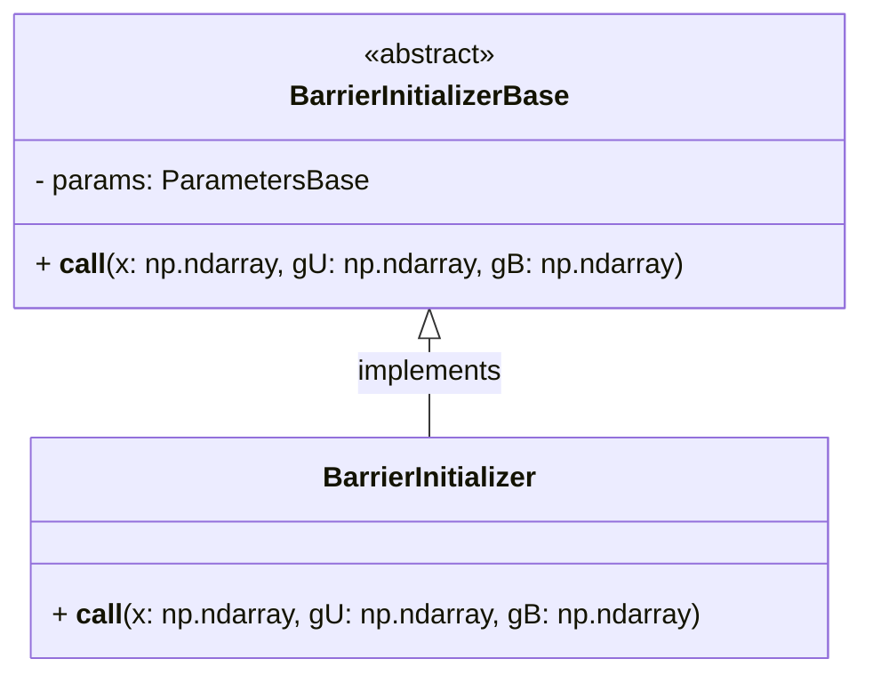
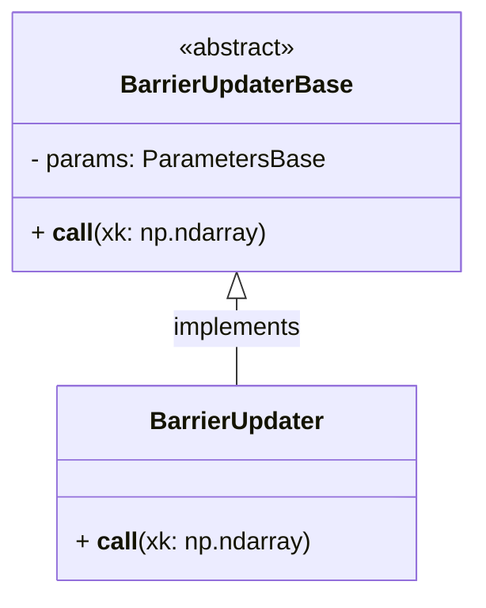
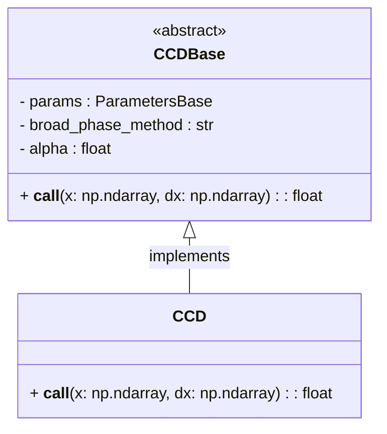

# Contact Module

The `simulation/core/contact` module provides implementations for handling contact-related computations in simulations, including barrier initializers, barrier updaters, and collision detection (CCD).

---

## Barrier Initializer

### Description

The `BarrierInitializer` class initializes barrier parameters based on input data. It is responsible for setting up stiffness and other barrier-related parameters essential for simulation stability and collision handling.

### Class

::: simulation.core.contact.barrier_initializer

---

## Barrier Updater

### Description

The `BarrierUpdater` class updates barrier stiffness dynamically during simulations based on the current positions. This ensures stability and accuracy as the simulation evolves.

### Class

::: simulation.core.contact.barrier_updater

---

## CCD (Collision Detection)

### Description

The `CCD` class calculates the maximum collision-free step size for position updates, ensuring no interpenetration of objects during simulations.

### Class

::: simulation.core.contact.ccd
