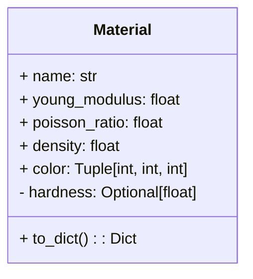
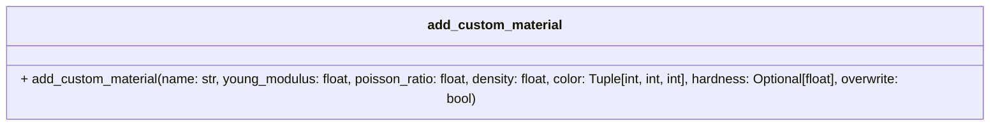
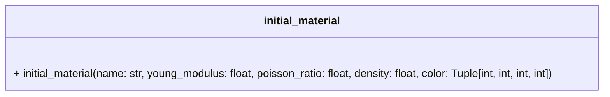

# Materials Module

The `simulation/core/materials` module provides the foundational data structures and utility functions for handling material properties in simulations. These materials are characterized by their physical properties such as Young's modulus, Poisson's ratio, density, and optional properties like color and hardness.

---

## Material Class

### Description

The `Material` class defines the properties of a material, including essential attributes such as Young's modulus, Poisson's ratio, and density. It also provides functionality for serialization into dictionary format.



### Class

::: simulation.core.materials.materials.Material

---

## Predefined Materials

The module includes a collection of predefined materials such as wood, steel, aluminum, rubber, and more. Each material has preset physical properties, making it easy to use in simulations without requiring custom definitions.

### Example Predefined Material

```python
Material(
    name="WOOD",
    young_modulus=10e9,
    poisson_ratio=0.35,
    density=600,
    color=(139, 69, 19)
)
```

---

## Add Custom Material

### Description

The `add_custom_material` function allows users to define new materials or overwrite existing ones with specific properties.



#### Function

::: simulation.core.materials.materials.add_custom_material

---

## Initial Material

### Description

The `initial_material` function initializes a material by its name. If the material does not exist, it creates a custom material with default or provided properties.



#### Function

::: simulation.core.materials.materials.initial_material
