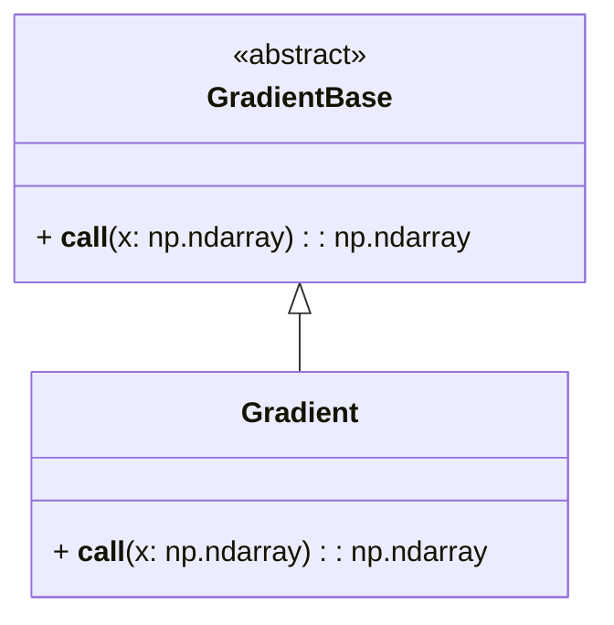

# Math

The `simulation/core/math` module provides essential classes and functionalities for mathematical computations required in the simulation. These include calculating gradients, Hessians, and potential energies.

## Gradient

### Description

The `Gradient` class is responsible for computing the gradient vector, which represents the derivative of the potential energy with respect to the positional variables.



### Class

::: simulation.core.math.gradient.Gradient

---

### Factory

The `GradientFactory` class is responsible for creating instances of gradient computation methods.

::: simulation.core.math.gradient.GradientFactory

---

## Hessian

### Description

The `Hessian` class computes the second derivative matrix (Hessian) of the potential energy. This matrix is essential for Newton-based optimization and stability analysis.


```mermaid

    class HessianBase {
        <<abstract>>
        + __call__(x: np.ndarray) : sp.sparse.csc_matrix
    }
    class Hessian {
        + __call__(x: np.ndarray) : sp.sparse.csc_matrix
    }
    HessianBase <|-- Hessian
```

### Class

::: simulation.core.math.hessian.Hessian

---

### Factory

The `HessianFactory` class creates instances of Hessian computation methods.

::: simulation.core.math.hessian.HessianFactory

---

## Potential

### Description

The `Potential` class calculates the total potential energy of the system, combining elastic, barrier, and friction potentials.

```mermaid

    class PotentialBase {
        <<abstract>>
        + __call__(x: np.ndarray) : float
    }
    class Potential {
        + __call__(x: np.ndarray) : float
    }
    PotentialBase <|-- Potential
```

### Class

::: simulation.core.math.potential.Potential

---

### Factory

The `PotentialFactory` class generates instances for computing potential energies.

::: simulation.core.math.potential.PotentialFactory

---


