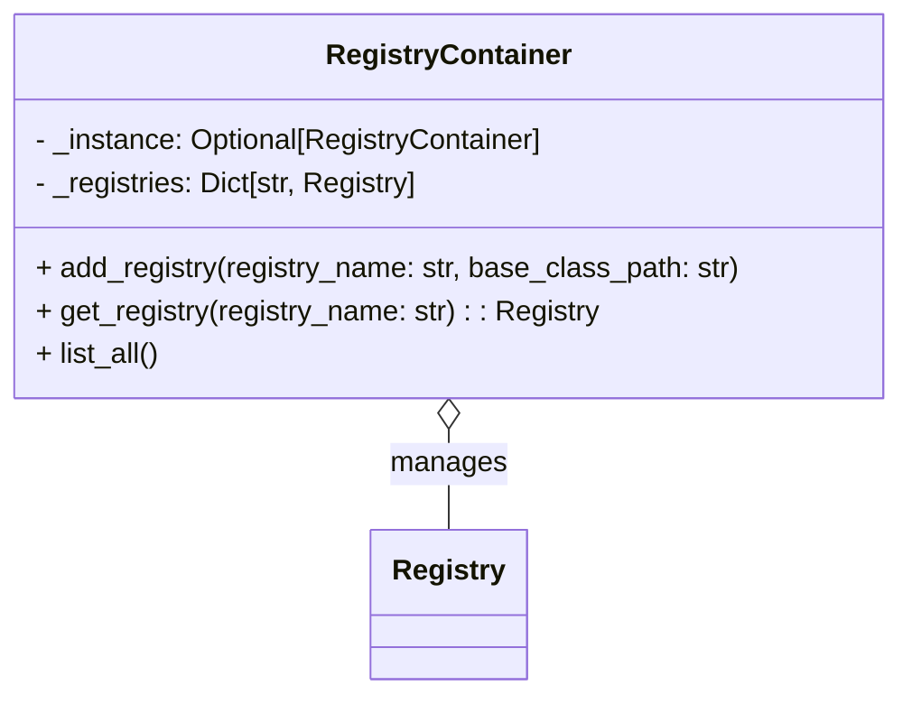
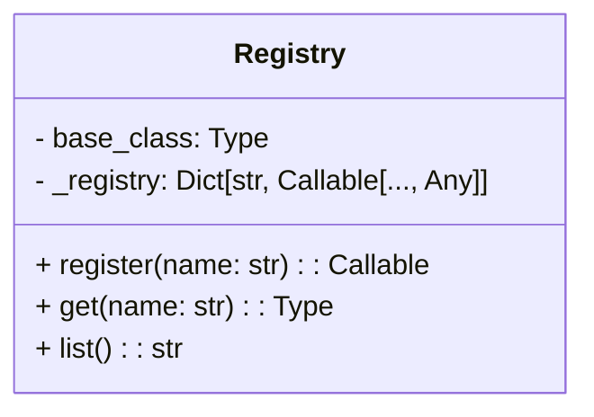
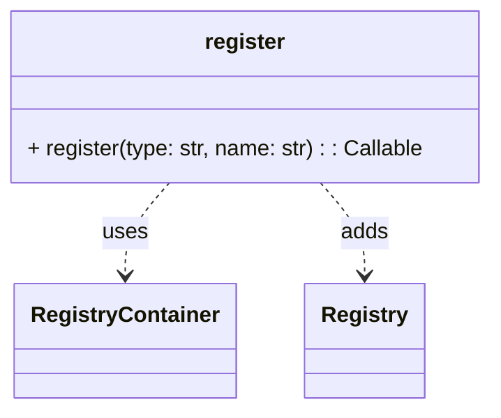

# Registry

The `simulation/core/registry` module provides a flexible system for registering and retrieving components dynamically. It allows developers to create, manage, and access different registries for various simulation components.

---

## RegistryContainer

### Description

The `RegistryContainer` class is a singleton that manages multiple registries for different component types, such as `line_search`, `optimizer`, and others. It ensures that only one instance of each registry exists throughout the application.

### Class

::: simulation.core.registry.container.RegistryContainer

---

## Registry

### Description

The `Registry` class is a generic system for registering and retrieving classes. It ensures that all registered classes inherit from a specified base class.

### Class

::: simulation.core.registry.registry.Registry

---

## Register Decorator

### Description

The `register` decorator is used to dynamically register a class in a specified registry. It associates a class with a name and ensures it is added to the correct registry.

### Decorator

::: simulation.core.registry.decorators.register

---
