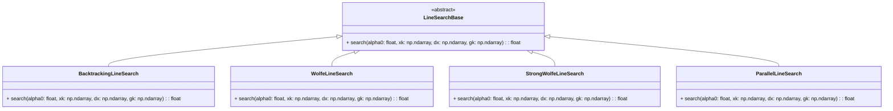

# Solvers

The `simulation/core/solvers` module provides advanced mathematical tools for solving optimization problems in simulations. This includes implementations for linear solvers, line search algorithms, and optimizers.

---

## Line Search

### Description

Line search methods are used to find a step size \( \alpha \) that sufficiently decreases the objective function along a descent direction.

#### Line Search Base Class

The `LineSearchBase` class defines the structure for line search methods. Subclasses implement specific line search strategies.

#### Line Search Implementations

- **BacktrackingLineSearch**: Reduces the step size until the Armijo condition is met.
- **WolfeLineSearch**: Ensures both Armijo and curvature conditions are satisfied.
- **StrongWolfeLineSearch**: A more robust version of Wolfe conditions.
- **ParallelLineSearch**: Evaluates multiple step sizes in parallel.

::: simulation.core.solvers.line_search

---

## Linear Solvers

### Description

Linear solvers solve the equation \( A \mathbf{x} = \mathbf{b} \), where \( A \) is a sparse matrix, and \( \mathbf{x} \) and \( \mathbf{b} \) are vectors.

#### Linear Solver Base Class

The `LinearSolverBase` class defines the interface for all linear solvers.

```mermaid
classDiagram
    class LinearSolverBase {
        <<abstract>>
        + solve(A: sp.sparse.csc_matrix, b: np.ndarray, tol: float, max_iter: int) : np.ndarray
    }
    class LDLTSolver {
        + solve(A: sp.sparse.csc_matrix, b: np.ndarray, tol: float, max_iter: int) : np.ndarray
    }
    class CholeskySolver {
        + solve(A: sp.sparse.csc_matrix, b: np.ndarray, tol: float, max_iter: int) : np.ndarray
    }
    class CGSolver {
        + solve(A: sp.sparse.csc_matrix, b: np.ndarray, tol: float, max_iter: int) : np.ndarray
    }
    class LUSolver {
        + solve(A: sp.sparse.csc_matrix, b: np.ndarray, tol: float, max_iter: int) : np.ndarray
    }
    class DirectSolver {
        + solve(A: sp.sparse.csc_matrix, b: np.ndarray, tol: float, max_iter: int) : np.ndarray
    }
    LinearSolverBase <|-- LDLTSolver
    LinearSolverBase <|-- CholeskySolver
    LinearSolverBase <|-- CGSolver
    LinearSolverBase <|-- LUSolver
    LinearSolverBase <|-- DirectSolver
```

#### Linear Solver Implementations

- **LDLTSolver**: Performs LDLT decomposition.
- **CholeskySolver**: Uses Cholesky decomposition for symmetric positive-definite matrices.
- **CGSolver**: Uses the Conjugate Gradient method for sparse systems.
- **LUSolver**: Uses LU decomposition for general matrices.
- **DirectSolver**: Solves the system directly using sparse solvers.

::: simulation.core.solvers.linear

---

## Optimizers

### Description

Optimizers iteratively solve optimization problems by minimizing a target function \( f(x) \). They utilize line search methods and linear solvers for step calculation.

#### Optimizer Base Class

The `OptimizerBase` class defines the interface for all optimization algorithms.

#### Optimizer Implementations

- **NewtonOptimizer**: Uses second-order derivatives (Hessian) for optimization.
- **BFGSOptimizer**: A quasi-Newton method that approximates the Hessian.
- **LBFGSOptimizer**: A memory-efficient variant of BFGS.

::: simulation.core.solvers.optimizer

---
