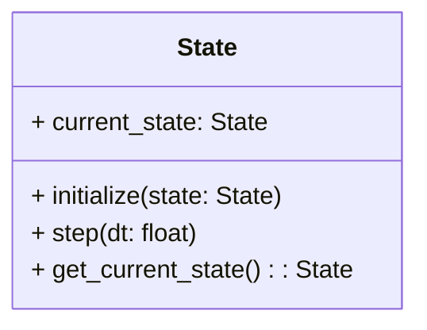

# States

The `simulation/core/states` module provides the framework for managing and evolving states within the simulation. States represent the system's configuration and are updated iteratively through optimization and numerical methods.

---

## State

### Description

The `State` manages the evolution of the simulation's states. It applies numerical solvers and optimization algorithms to update states iteratively.

### Class

::: simulation.core.states.state

---
