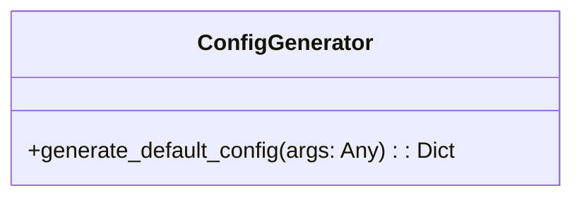
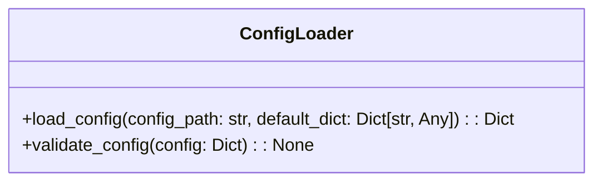
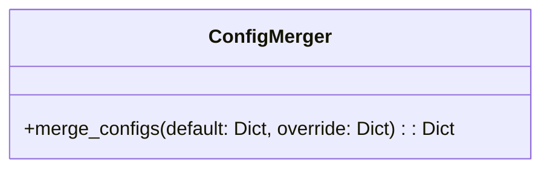
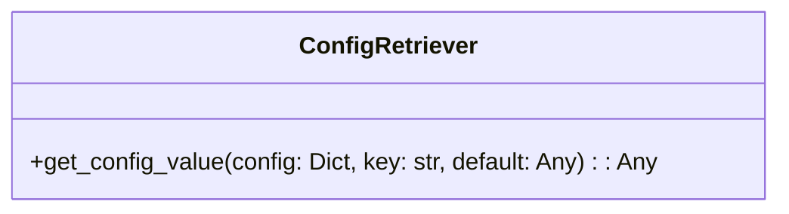
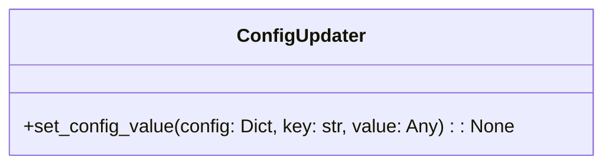
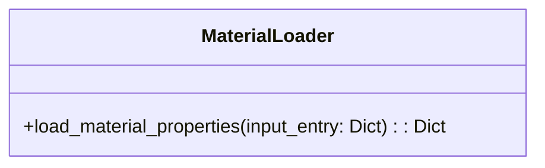
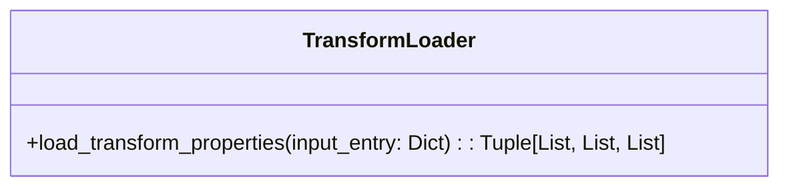

# Configuration Management

The `simulation.core.utils.config` module provides a comprehensive set of tools for managing and validating simulation configurations. It supports loading configurations from JSON or YAML files, generating default configurations, and retrieving or updating configuration values.

---

## **Configuration Workflow**

### 1. **Default Configuration Generation**

Generates a default configuration with pre-set simulation settings.

**Function: `generate_default_config`**

- **Arguments**:
  - `args`: Parsed command-line arguments for optional customization.

- **Returns**:
  - A dictionary representing the default configuration.

---

### 2. **Loading Configuration**

Loads a configuration file, validates it against the schema, and merges it with defaults if needed.

**Function: `load_config`**

- **Arguments**:
  - `config_path` (str): Path to the configuration file (JSON or YAML).
  - `default_dict` (dict, optional): Default configuration.

- **Returns**:
  - A validated configuration dictionary.

- **Validation**:
  - Ensures the configuration adheres to the schema defined for simulation.

---

### 3. **Merging Configurations**

Combines a default configuration with an override configuration, where the override takes precedence.

**Function: `merge_configs`**

- **Arguments**:
  - `default` (dict): Base configuration.
  - `override` (dict): User-provided overrides.

- **Returns**:
  - A merged configuration dictionary.

---

### 4. **Retrieving Configuration Values**

Extracts a specific value from a configuration dictionary using a dotted key path.

**Function: `get_config_value`**

- **Arguments**:
  - `config` (dict): Configuration dictionary.
  - `key` (str): Dotted key path (e.g., `"simulation.dt"`).
  - `default` (Any, optional): Value to return if the key is not found.

- **Returns**:
  - The requested value or the default.

---

### 5. **Updating Configuration Values**

Sets a value in the configuration dictionary using a dotted key path.

**Function: `set_config_value`**

- **Arguments**:
  - `config` (dict): Configuration dictionary.
  - `key` (str): Dotted key path (e.g., `"simulation.dt"`).
  - `value` (Any): Value to set.

---

## **Material and Transform Utilities**

### **Material Properties**

Loads material properties from an input entry.

**Function: `load_material_properties`**

- **Arguments**:
  - `input_entry` (dict): An entry defining material properties.

- **Returns**:
  - A dictionary of material properties.

---

### **Transform Properties**

Loads and applies transformations (scale, rotation, translation) to mesh vertices.

**Function: `load_transform_properties`**

- **Arguments**:
  - `input_entry` (dict): Entry defining transformation properties.

- **Returns**:
  - A tuple containing scale, rotation, and translation values.

--- 

## **Schema Validation**

The configuration is validated against a predefined JSON schema to ensure consistency and correctness.

**Function: `validate_config`**
- Ensures all required fields are present and follow the expected format.
- Logs validation errors if the configuration is invalid.

--- 

This module ensures robust management of simulation configurations, supporting flexible, validated, and easy-to-manage simulation setups.