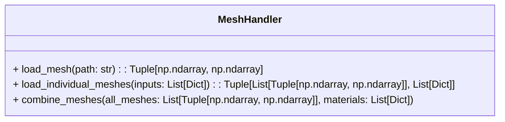

```markdown
# **Simulation Core Utilities: Input/Output (`simulation.core.utils.io`)**

This module provides functionalities for handling mesh files, including loading, processing, and combining meshes. It serves as the backbone for managing simulation geometries.

---

## **1. Load Mesh**

### Description

Loads a mesh from a specified file path using `meshio`.

### Function Signature
```python
def load_mesh(path: str) -> Tuple[np.ndarray, np.ndarray]:
```

### Arguments
- `path` (`str`): Path to the mesh file.

### Returns
- `Tuple[np.ndarray, np.ndarray]`: A tuple containing:
  - **Vertices**: Coordinates of the mesh vertices.
  - **Connectivity**: Indices defining tetrahedral cells.

### Exceptions
- Raises `ValueError` if no tetrahedral cells are found in the mesh.
- Logs errors if loading fails.

### Example
```python
vertices, connectivity = load_mesh("meshes/rectangle.mesh")
```

---

## **2. Load Individual Meshes**

### Description

Processes a list of mesh configurations by:
1. Loading mesh data.
2. Applying transformations (scale, rotation, translation).
3. Extracting material properties.

### Function Signature
```python
def load_individual_meshes(inputs: List[Dict]) -> Tuple[List[Tuple[np.ndarray, np.ndarray]], List[Dict]]:
```

### Arguments
- `inputs` (`List[Dict]`): List of dictionaries specifying mesh configurations.

### Returns
- `Tuple[List[Tuple[np.ndarray, np.ndarray]], List[Dict]]`:
  - **List of Meshes**: Each mesh as a tuple of vertices and connectivity.
  - **List of Material Properties**: Corresponding material properties.

### Example Input
```python
inputs = [
    {
        "path": "meshes/rectangle.mesh",
        "percent_fixed": 50,
        "material": "steel",
        "transform": {
            "scale": [1.0, 1.0, 1.0],
            "rotation": [0.0, 0.0, 0.0, 1.0],
            "translation": [0.0, 0.0, 0.0]
        }
    }
]
```

### Example Usage
```python
meshes, materials = load_individual_meshes(inputs)
```

---

## **3. Combine Meshes**

### Description

Combines multiple meshes into a single mesh, with optional deduplication of vertices for efficiency.

### Function Signature
```python
def combine_meshes(
    all_meshes: List[Tuple[np.ndarray, np.ndarray]],
    materials: List[Dict]
) -> Tuple[pbat.fem.Mesh, np.ndarray, np.ndarray, np.ndarray, List[int], Optional[List[Dict]]]:
```

### Arguments
- `all_meshes` (`List[Tuple[np.ndarray, np.ndarray]]`): List of tuples containing vertices and connectivity for individual meshes.
- `materials` (`List[Dict]`): Material properties corresponding to each mesh.

### Returns
- `Tuple[pbat.fem.Mesh, np.ndarray, np.ndarray, np.ndarray, List[int], Optional[List[Dict]]]`:
  - **Combined Mesh**: Mesh object from `pbatoolkit`.
  - **Vertices**: Combined vertices array.
  - **Connectivity**: Combined connectivity array.
  - **Element Materials**: Array indicating material for each element.
  - **Node Counts**: List of node counts per original mesh.

### Features
- Deduplicates vertices using precision rounding (`decimals=8`).
- Remaps connectivity to the deduplicated vertices.

### Example Usage
```python
combined_mesh, V, C, element_materials, node_counts = combine_meshes(all_meshes, materials)
```

### Logging
- Logs the number of nodes and elements before and after deduplication.
- Raises `ValueError` if connectivity remapping produces invalid indices.

---

## **Module Workflow**

1. **Load Individual Meshes**:
   - Reads mesh files.
   - Applies transformations.
   - Retrieves material properties.

2. **Combine Meshes**:
   - Combines meshes into a single structure.
   - Deduplicates vertices for optimization.

---

## **Class Diagrams**

### Mesh Loading and Processing


### Relationships
- The `combine_meshes` function integrates outputs from `load_individual_meshes`.

---
